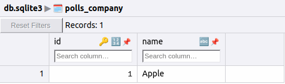
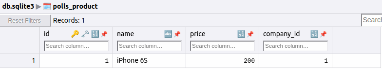
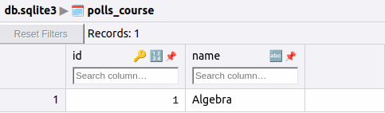
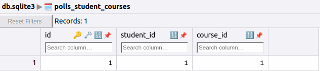

## One to One

```python
class User(models.Model):
    name = models.CharField(max_length=20)


class Account(models.Model):
    login = models.CharField(max_length=20)
	password = models.CharField(max_length=20)
    user = models.OneToOneField(User, on_delete = models.CASCADE, primary_key = True)
    
```

Для создание связей, используется конструктов вида **models.OneToOneField()**. Первый параметр указывает на то, с какой моделью он будет связан. Второй параметр **on_delete = models.CASCADE** говорит, что данные текущей модели (**UserAccount**) будут удаляться в случае удаления связанного объекта главной модели (**User**). Третий параметр **primary_key = True** указывает, что внешний ключ (через который идет связь с главной моделью) в то же время будет выступать и в качестве первичного ключа. И соответственно создавать отдельное поле для первичного ключа не надо.

### Операции с моделями

С помощью свойства user в модели Account мы можем манипулировать связанным объектом модели User:

```python
# создадим пользователя
sam = User.objects.create(name="Sam")
 
# создадим аккаунт пользователя Sam
acc = Account.objects.create(login = "1234", password="6565", user=sam)
 
# изменяем имя пользователя
acc.user.name = "Bob"
# сохраняем изменения в бд
acc.user.save()
 
print(f"{acc.user.name}, login: {acc.login}, password: {acc.password}")
# Bob, login: 1234, password: 6565

```

Однако через модель User мы также можем оказывать влияние на связанный объект Account. Несмотря на то, что явным образом в модели User определено только одно свойство - name, при связи один к одному неявно создается еще одно свойство, которое называется по имени зависимой модели и которое указывает на связанный объект этой модели. То есть в данном случае это свойство будет называться "account":

```python
# создадим пользователя
tom = User.objects.create(name="Tom")
     
# создадим аккаунт пользователя
acc = Account(login = "1234", password="6565")
tom.account = acc
tom.account.save()
 
# обновляем данные
tom.account.login = "qwerty"
tom.account.password = "123456"
tom.account.save()
print(f"{tom.name}, login: {tom.account.login}, password: {tom.account.password}")
# Tom, login: qwerty, password: 123456

```

Подобным образом можно выполнять фильтрацию по обоим моделям и их свойствам:

```python
# получим пользователя
tom = User.objects.get(name="Tom")
         
# получим аккаунт пользователя
tom_acc = Account.objects.get(user=tom)
print(f"login: {tom_acc.login}, password: {tom_acc.password}")
# login: qwerty, password: 123456
 
# получим аккаунт по имени пользователя
bob_acc = Account.objects.get(user__name="Bob")
print(f"login: {bob_acc.login}, password: {bob_acc.password}")
     
# получим пользователя по логину
user = User.objects.get(account__login="qwerty")
print(user.name)

```

Как модели отображаются в бд:

**Class User**


**Class Account**


## One to Many

```python
class Company(models.Model):
    name = models.CharField(max_length=30)
 
class Product(models.Model):
    company = models.ForeignKey(Company, on_delete = models.CASCADE)
    name = models.CharField(max_length=30)
    price = models.IntegerField()
    
```

В данном случае модель **Company** представляет производителя и является главной моделью, а модель **Product** представляет товар компании и является зависимой моделью.

Конструктор типа **models.ForeignKey** настраивает связь с главной сущностью. Первый параметр указывает, с какой моделью будет создаваться связь - в данном случае это модель **Company**. Второй параметр - **on_delete** задает опцию удаления объекта текущей модели при удалении связанного объекта главной модели. Всего для параметра on_delete мы можем использовать следующие значения:

-   **models.CASCADE**: автоматически удаляет строку из зависимой таблицы, если удаляется связанная строка из главной таблицы
    
-   **models.PROTECT**: блокирует удаление строки из главной таблицы, если с ней связаны какие-либо строки из зависимой таблицы
    
-   **models.SET_NULL**: устанавливает NULL при удалении связанной строка из главной таблицы
    
-   **models.SET_DEFAULT**: устанавливает значение по умолчанию для внешнего ключа в зависимой таблице. В этом случае для этого столбца должно быть задано значение по умолчанию
    
-   **models.DO_NOTHING**: при удалении связанной строки из главной таблицы не производится никаких действий в зависимой таблице

### Операции с моделями

Из определения таблиц мы видим, что модель **Product** связана с таблицей **Company** через столбец "**company_id**". Однако в самом определении модели Product есть поле company, через которое можно получить связанную сущность:

```python
# получение id связанной с товаром компании
Product.objects.get(id=1).company.id
 
# получение названия связанной с товаром компании
Product.objects.get(id=1).company.name
 
# получение товаров, которые принадлежат к компании "Apple"
Product.objects.filter(company__name="Apple")
```

С помощью выражения модель__свойство (два подчеркивания) можно использовать свойство главной модели для фильтрации по объектам зависимой модели.

Хотя с точки зрения модели **Company** она не имеет никаких свойств, которые связывали бы ее с моделью **Product**. Но с помощью синтаксиса

```python
"главная_модель"."зависимая_модель"_set
```

Можно изменить направление связи. Например:

```python
apple = Company.objects.get(name="Apple")
 
# получение всех товаров
apple.product_set.all()
 
# получение количества товаров
apple.product_set.count()
 
# получение товаров, название которых начинается на "iPhone"
apple.product_set.filter(name__startwith="iPhone")
```

Причем с помощью выражения **set** можно выполнять операции добавления, изменения, удаления объектов зависимой модели из главной модели.

```python
# создаем объект Company
apple = Company.objects.create(name="Apple")
 
 
# создание товара определенной компании
apple.product_set.create(name="iPhone 8", price=67890)
 
# отдельное создание объекта с последующим добавлением
ipad = Product(name="iPad", price=34560)
# при добавлении необходимо указать параметр bulk =False
apple.product_set.add(ipad, bulk=False)
 
# исключает из компании все товары, 
# при этом товары остаются в бд, просто им не назначена компания
# работает, если в зависимой модели ForeignKey(Company, null = True)
# apple.product_set.clear()
 
# то же самое, только в отношении одного объекта
# ipad = Product.objects.get(name="iPad")
# apple.product_set.remove(ipad)
```

Стоит отметить три метода:

- **add()**: добавляет связь между объектом зависимой модели и объектом главной модели. В своей сути этот метод фактически вызывает для модели метод update() для добавления связи. Однако это требует, чтобы обе модели уже были в базе данных. И чтобы обойти это ограничение, применяется параметр bulk=False, для того, чтобы объект зависимой модели сразу был добавлен и для него была установлена связь.

- **clear()**: удаляет связь между всеми объектами зависимой модели и объектом главной модели. При этом сами объекты зависимой модели остаются в базе данных, и для их внешнего ключа устанавливается значение NULL. Поэтому данный метод будет работать, если в самой зависимой модели при установки связи использовался параметр null=True: ForeignKey(Company, null = True).

- **remove()**: также, как и clear() удаляет связь, только между одним объектом зависимой модели и объектом главной модели. При этом также все объекты остаются в бд. И также в самой зависимой модели при установки связи должен использоваться параметр null=True

Как модели отображаются в бд:





## Many to Many

Связь многие ко многим описывает ситуацию, когда объект первой модели может одновременно ассоциироваться с несколькими объектами второй модели. И наоборот, один объект второй модели может также одновременно быть ассоциирован с несколькими объектами первой модели. Например, один студент может посещать несколько курсов, а один курс могут посещать несколько студентов.

Для создания отношения многие ко многим применяется тип **ManyToManyField**.

```python
class Course(models.Model):
    name = models.CharField(max_length=30)
 
class Student(models.Model):
    name = models.CharField(max_length=30)
    courses = models.ManyToManyField(Course)
    
```

В конструктор **models.ManyToManyField** передается сущность, с которой устанавливается отношение многие ко многим. В результате будет создаваться промежуточная таблица, через которую собственно и будет осуществляться связь.

### Операции с моделями

Через свойство **courses** в модели **Student** мы можем получать связанные со студентом курсы и управлять ими.

```python
# создадим студента
tom = Student.objects.create(name="Tom")
 
# создадим один курс и добавим его в список курсов Тома
tom.courses.create(name="Algebra")
 
# получим все курсы студента
courses = Student.objects.get(name="Tom").courses.all()
 
# получаем всех студентов, которые посещают курс Алгебра
students = Student.objects.filter(courses__name="Algebra")

```

Стоит отметить последний случай, где производится фильтрация студентов по посещаемому курсу. Для передачи в метод **filter** названия курса используется параметр, название которого начинается с названия свойства, через которое идет связь со второй моделью. И далее через два знака подчеркивания указывается имя свойства второй модели, например, **courses__name** или **courses__id**.

В данном случае мы можем получить информацию о курсах студента через свойство courses, которое определено в модели **Student**. Однако что если мы хотим получить информацию о студентах по определенному курсу? В этом случае нам надо использовать синтаксис __**set**.

```python
# создадим курс
python = Course.objects.create(name="Python")
 
# создаем студента и добавляем его на курс
python.student_set.create(name="Bob")
 
# отдельно создаем студента и добавляем его на курс
sam = Student(name="Sam")
sam.save()
python.student_set.add(sam)
 
# получим всех студентов курса
students = python.student_set.all()
 
# получим количество студентов по курсу
number = python.student_set.count()
 
# удялем с курса одного студента
python.student_set.remove(sam)
 
# удаляем всех студентов с курса
python.student_set.clear()

```

Как модели выглядят в бд:




